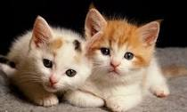

# Cat_Classifier_ANN
This is an artificial neural network model for the classification of cat and non-cat images. It outputs 1 when a cat image is given as input and 0 when a non-cat image is given as input. The model gives approx 98% accuracy on the training set and 80% accuracy on the test set. It is a basic model and uses python libraries like NumPy, matplotlib, OpenCV, pillow, and scipy.

References (datasets):
Ng, A., Katanforoosh, K. & Mourri, Y. B., 2020. Neural Networks and Deep Learning. s.l.:Coursera.

